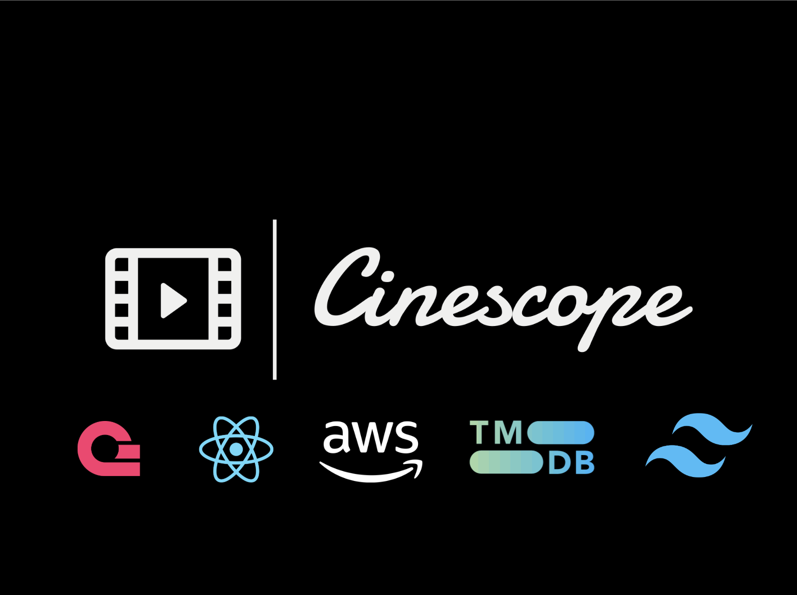

# 🎬 CineScope – Movie Discovery App

CineScope is a **movie discovery application** that allows users to search, explore, and view information about movies — including posters, ratings, and release dates — using the power of The Movie Database (TMDB) API. This not only improves performance and scalability but also ensures that users receive up-to-date and accurate movie information. Built on React 19, CineScope aims to demonstrate the the seamless integration and the critical role APIs play in modern web development — enabling applications to access rich, real-time content without managing massive datasets manually. 

**Data Management**:  While TMDB offers a “Popular” endpoint, CineScope enhances the experience by creating its own **"Trending"** section. Movie data (ID, title, poster, and view count) is stored and fetched from **Appwrite**, enabling dynamic trending logic based on user interaction or predefined metrics.

## 🚀 Features

- 🔍 **Real-time Search with Debouncing:** Optimized search input using a custom `useDebounce` hook to reduce redundant API calls.

- 🔐 **Safe API Queries:** Leveraged `encodeURIComponent()` to safely format user input for API requests.

- 🔥 **Custom Trending Section:** Created a "Trending" movie section by storing and retrieving view-count-based movie data via **[Appwrite]**. This goes beyond TMDB's default "Popular" listing.

- 🎨 **Modern Responsive UI:** Styled using **[Tailwind CSS](https://tailwindcss.com/) 4.1** with a clean, dark-themed layout and responsive design.

- ⚡ **Fast Build with Vite:** Utilized [Vite](https://vite.dev/) for lightning-fast development and production builds.

- ☁️ **Deployed on AWS Amplify:** Manually deployed using AWS Amplify for reliable, serverless hosting.

## 🧰 Tech Stack

- **Frontend:** React 19, Tailwind CSS 4.1, Vite
- **API:** [The Movie Database (TMDB)](https://www.themoviedb.org/)
- **Backend as a Service:** [Appwrite](https://appwrite.io/)
- **Hosting:** AWS Amplify

## 📦 Deployment
- Run `npm run build` to generate the dist/ folder.
- Zip the contents of the dist/ folder (not the folder itself).
- Upload the archive manually to **[AWS Amplify](https://aws.amazon.com/console/)** for deployment.

## 📸 Screenshots

